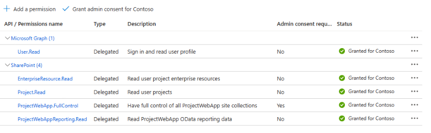
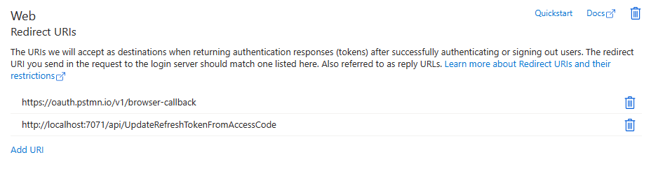
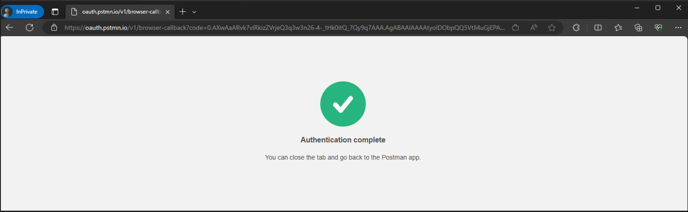
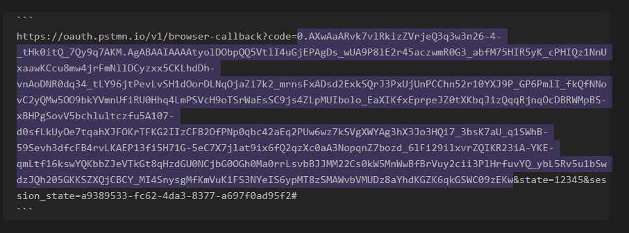
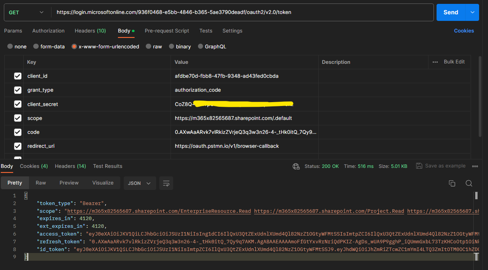
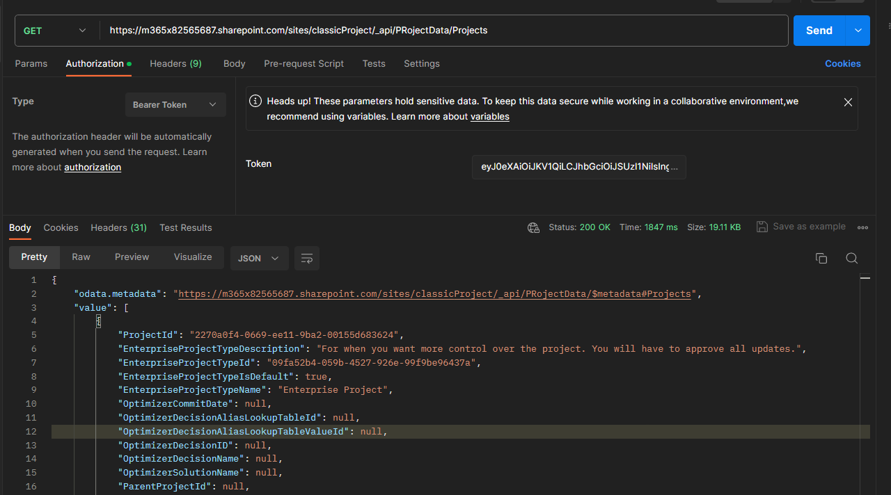
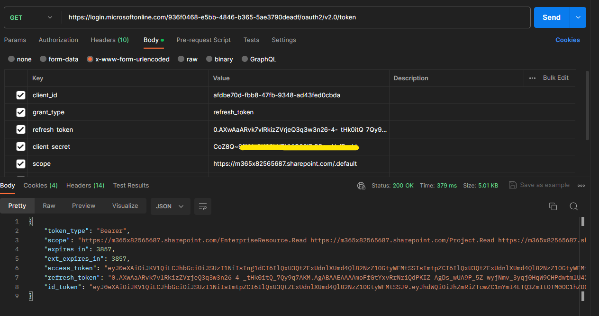

## ProjectOnline Auth Hack

We need a way to access PorjectOnline data (in SharePoint) in an automated way, without user interaction. Unfortunalty, Project Online does not support App only authentication. We also can't use basic auth.

The approach is to use delegated access. This is application access on behalf of a user using the applications identity.

Further details of this approach can be found here - [Get access on behalf of a user - Microsoft Graph | Microsoft Learn](https://learn.microsoft.com/en-us/graph/auth-v2-user?tabs=http)

> [!NOTE]  
> We will be manuly handling access code and auth tokens. This is generally not recommended when working with AAD. You should use MSAL SDKs to securly handel auth tokens. However when needs must we sometimes have to go aginst recommendations!

### Auth Method

The authentication method is OAuth 2.0 authorization code flow grant - This is not basic auth. Further detail of the authorization method can be found here - [Microsoft identity platform and OAuth 2.0 authorization code flow | Microsoft Learn](https://learn.microsoft.com/en-us/entra/identity-platform/v2-oauth2-auth-code-flow)

> [!NOTE]  
> This method will still require a user account that has access to the Project Online Site Collections. We will need a user that give consent to the app to access the Project Online resources on their behalf.

### PreReqs

We require an app registration in Azure AD. 

1. Add the following delegated SPO permissions



2. The app requires a redirect URI - This URI will be where the code is returned that is required to authorize the on behalf of (delegated) application connection



The below URI, will allow the accesstoken to be returned to a local instance of the Azure Function. When deployed to Azure, you can either update or add an aditional URI for the deployed version of the function.

`http://localhost:7071/api/UpdateRefreshTokenFromAccessCode`

For testing purposes the below can also be inlcuded - This will enable the auth code to be returned to a browser

`https://oauth.pstmn.io/v1/browser-callback`

3. Generate a secret, this will be needed later. So if you do this now, please save it somewhere.

### Testing without the deployed function

Before we get ahead of ourselves we should really test this out. This will not only prove that this method works but will also show you how Oauth 2.0 works.

1. Execute the following HTTP request in a browser (if authenticated you see no login prompt). 

> [!NOTE]  
> This browser session needs to be authenticated by the user that has access to the Project Online Site Collection.

Replace `{tenantId}` with your tenantId
Replace `afdbe70d-fbb8-47fb-9348-ad43fed0cbda` with the appId of the pp registration you just created

```
https://login.microsoftonline.com/{tenantId}/oauth2/v2.0/authorize
  ?client_id=afdbe70d-fbb8-47fb-9348-ad43fed0cbda
  &response_type=code
  &redirect_uri=https://oauth.pstmn.io/v1/browser-callback 
  &response_mode=query&scope=profile openid email https://graph.microsoft.com/EnterpriseResource.Read https://graph.microsoft.com/Project.Read https://graph.microsoft.com/ProjectWebApp.FullControl https://graph.microsoft.com/ProjectWebAppReporting.Read https://graph.microsoft.com/User.Read offline_access&state=12345
```

> [!NOTE]  
> client_id should be updated to reflect the app registration that was created in the previous step

Once authenticated, you will be redirected to the redirect URI



In the URL you will have something similar to the below:

```
https://oauth.pstmn.io/v1/browser-callback?code=0.AXwAaARvk7vlRkizZVrjeQ3q3w3n26-4-_tHk0itQ_7Qy9q7AKM.AgABAAIAAAAtyolDObpQQ5VtlI4uGjEPAgDs_wUA9P8lE2r45aczwmR0G3_abfM75HIR5yK_cPHIQz1NnUxaawKCcu8mw4jrFmNllDCyzxx5CKLhdDh-vnAoDNR0dq34_tLY96jtPevLvSH1dOorDLNqOjaZi7k2_mrnsFxADsd2ExkSQrJ3PxUjUnPCChn52r10YXJ9P_GP6PmlI_fkQfNNovC2yQMw5OO9bkYVmnUfiRU0Hhq4LmPSVcH9oTSrWaEsSC9js4ZLpMUIbolo_EaXIKfxEprpeJZ0tXKbqJizQqqRjnqOcDBRWMpBS-xBHPgSovV5bchlultczfu5A107-d0sfLkUyOe7tqahXJFOKrTFKG2IIzCFB2OfPNp0qbc42aEq2PUw6wz7kSVgXWYAg3hX3Jo3HQi7_3bsK7aU_q1SWhB-59Sevh3dfcFB4rvLKAEP13fi5H71G-5eC7X7jlat9ix6fQ2qzXc0aA3NopqnZ7bozd_6lFi29ilxvrZQIKR23iA-YKE-qmLtf16kswYQKbbZJeVTkGt8qHzdGU0NCjbG0OGh0Ma0rrLsvbBJJMM22Cs0kW5MnWwBfBrVuy2cii3PlHrfuvYQ_ybL5Rv5u1bSwdzJQh205GKKSZXQjCBCY_MI4SnysgMfKmVuK1FS3NYeIS6ypMT8zSMAWvbVMUDz8aYhdKGZK6qkGSWC09zEKw&state=12345&session_state=a9389533-fc62-4da3-8377-a697f0ad95f2#
```

> [!NOTE]  
> The important part of this is the `code` parameter. This is also an expired code 👀



Now that we have the code we can get a delegated app authentication session to MSGraph

2. Make a HTTP to AAD to get an access token with SPO claims.

The request should be sent to the following URL

`https://login.microsoftonline.com/936f0468-e5bb-4846-b365-5ae3790deadf/oauth2/v2.0/token`

The GUID in the URL is the tenant ID

Sample parameters

| Key          | Value |
|--------------|-------|
| client_id    | afdbe70d-fbb8-47fb-9348-ad43fed0cbda |
| grant_type   | authorization_code |
| redirect_uri | https://oauth.pstmn.io/v1/browser-callback |
| client_secret| *secret from earlier* |
| scope        | https://m365x82565687.sharepoint.com/.default |
| code         | 0.AXwAaARvk7vlRkizZVrwvd7BlMjZTXrMxUYnl11Q-mrzATMVk_BHIPT1V5-nRKPksBFIc |

> [!NOTE]  
> Again, client_id should be updated to reflect the app registration that was created in the previous step

Postman request and response



3. Finally we can all the project online rest APIs

It's now possible to call the Project Online rest APIs using the access token returned in the last postman request.

To test this in Postman, make a get request to the following URL - Update the first section to be the URL of the ProjectOnline Site Collection

`https://m365x82565687.sharepoint.com/sites/classicProject/_api/projectdata/Projects`

> [!NOTE]  
> Ensure you add the `access_token` to the Authorization tab



Cool, if this works you have done everything correctly. 

## The Auth Hack

This is where the hack comes in. A refresh token (unless invalidated by something like a password change) will typically last 90 days. We can use anotehr token request, using an existing refresh token to get a new access token.

To test this you can perform the following, again in Postman.

The request should be sent to the following URL

`https://login.microsoftonline.com/936f0468-e5bb-4846-b365-5ae3790deadf/oauth2/v2.0/token`

The GUID in the URL is the tenant ID

| Key          | Value |
|--------------|-------|
| client_id    | afdbe70d-fbb8-47fb-9348-ad43fed0cbda |
| grant_type   | refresh_token |
| refresh_token | 0.AXwAaARvk7vlRkizZVrjeQ3q3w3n26-4 |
| client_secret| *secret from earlier* |
| scope        | https://m365x82565687.sharepoint.com/.default |



So to automate all of this, we need to handle the persistant storage of a the refresh token. As long as we have this, we can keep our auth session active without the need for the user the reauthenticate.

## Function

An Azure function has been developed as the vehical to automate all of the above and also sned the data to a SQL database.


## Project Online Data

What data is required?
	Would be best to have a list of APIs

	Projcts
	Projects baseline
	Tasks
	Task baseline
	Assignment
	Assignment baseline
	Resrouces

We want the daily deltas

How often is the sync required?
	Daily

Where is the data going?
	SQL

![[Pasted image 20231109105551.png]]

Everything else can stay the same

The PowerBI report


Scale should be consideration


Staging table
	is cleared


Initialization web app that can send a new auth token to the Azure function
	For intilization and when a newpassword is required
	Every 90 days
	Token stored in KV?

![[Pasted image 20231116110828.png]]


A savage API endpoint to look at all the models

[m365x82565687.sharepoint.com/sites/classicProject/_api/PRojectData/$metadata#AssignmentBaselines](https://m365x82565687.sharepoint.com/sites/classicProject/_api/PRojectData/$metadata#AssignmentBaselines)

